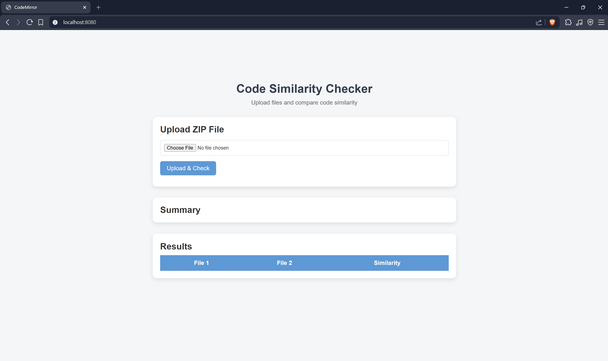
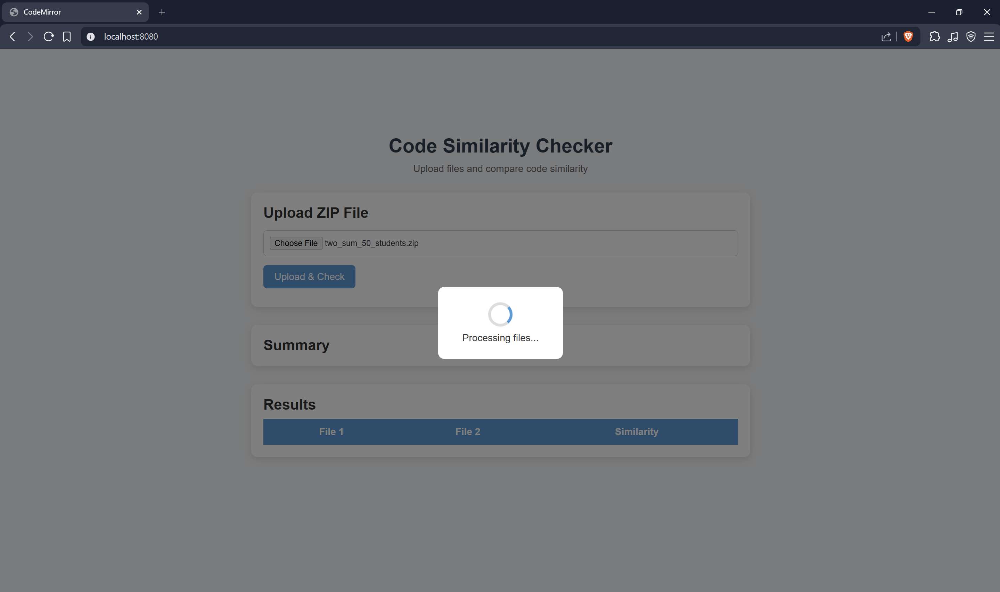
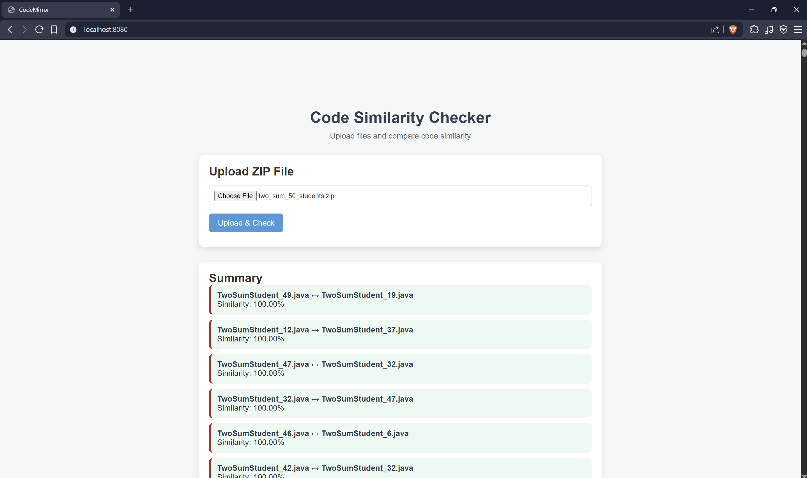
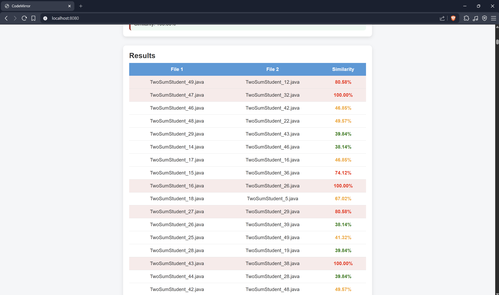

# CodeMirror – Code Similarity Checker

CodeMirror is a Java-based code similarity checker that compares two source code files and analyzes their similarity using preprocessing and comparison techniques.

The project was built to explore how plagiarism detection systems and code comparison tools work internally.

---

## Features

- Compare two code files
- Similarity percentage generation
- Code normalization and filtering
- Removal of unnecessary formatting differences
- Backend processing logic
- Modular project structure

---

## Tech Stack

- Java
- Maven
- File Handling
- String Processing
- OOP Concepts

---

## Project Structure

The project follows a modular structure where:
- Normalization handles preprocessing
- Filtering removes unnecessary variations
- Similarity logic computes comparison results
- Result generation displays final similarity metrics

---

## How It Works

1. Input source code files are uploaded/read
2. The code is normalized and cleaned
3. Unnecessary spaces/symbol variations are filtered
4. Similarity logic compares processed code
5. Final similarity percentage is generated

---

## Similarity Detection Algorithm

The similarity checker works by preprocessing and comparing source code files through multiple stages.

### Step 1: Code Normalization
The input code is first normalized to reduce superficial differences such as:
- Extra spaces
- Line breaks
- Indentation differences
- Formatting inconsistencies

This helps ensure that logically similar programs are not treated as different simply because of coding style variations.

### Step 2: Filtering
The filtering stage removes unnecessary elements and standardizes the structure of the code before comparison.

Examples include:
- Removing redundant whitespace
- Cleaning unnecessary formatting symbols
- Standardizing comparable content

This preprocessing improves the accuracy of similarity detection.

### Step 3: N-Gram Analysis
After preprocessing, the project performs similarity analysis using the N-Gram technique.

N-Gram analysis works by breaking the processed code into smaller continuous sequences (chunks) of characters or tokens.

Example:
Code: public static void
3-grams:
pub
ubl
bli
lic
...

The generated N-Grams from both files are then compared to identify:
- Common patterns
- Matching sequences
- Structural similarity between programs

The greater the overlap between N-Grams, the higher the similarity score.

This approach helps detect similarity even when:
- Variable names are changed
- Formatting is modified
- Minor edits are introduced

### Step 4: Similarity Score Generation
After comparison, the matching patterns are analyzed to generate a final similarity percentage between the two source files.

### Step 5: Result Generation
The processed similarity results are displayed in an understandable format showing:
- Similarity percentage
- Comparison outcome
- Processed comparison data

---


## Learning Outcomes

Through this project, I learned:
- Java project structuring
- File handling in Java
- String manipulation techniques
- Backend logic implementation
- Modular programming practices
- Problem-solving using real-world ideas

---

## Future Improvements

- AST-based code comparison
- Multi-language support
- Better UI/UX
- Web deployment
- Database integration
- Advanced plagiarism detection techniques

---

## Screenshots
### Initial Interface

### Zip FIle Is Selected And Sent For Processing

### Summary Table Produced

### All Comparisons Made


---

## Run Locally

```bash
git clone https://github.com/work-7221/CodeMirror.git
cd CodeMirror